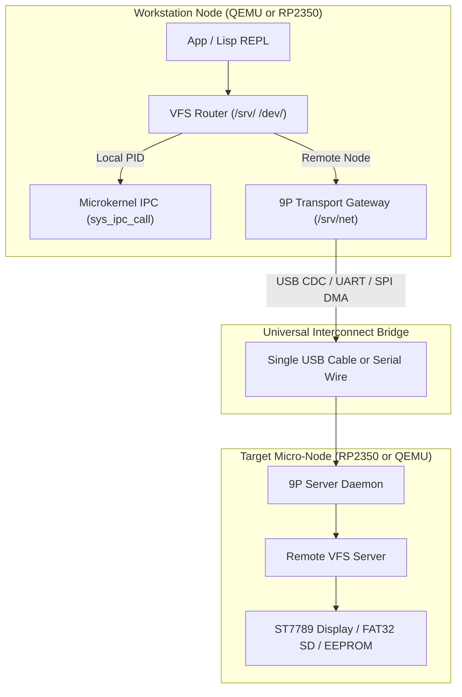
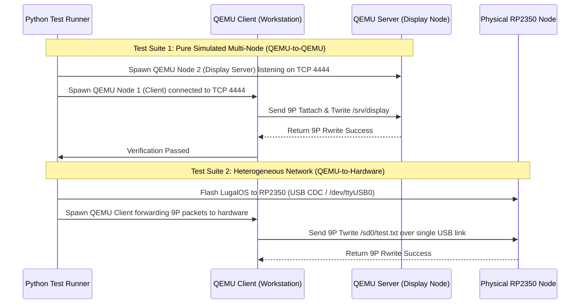
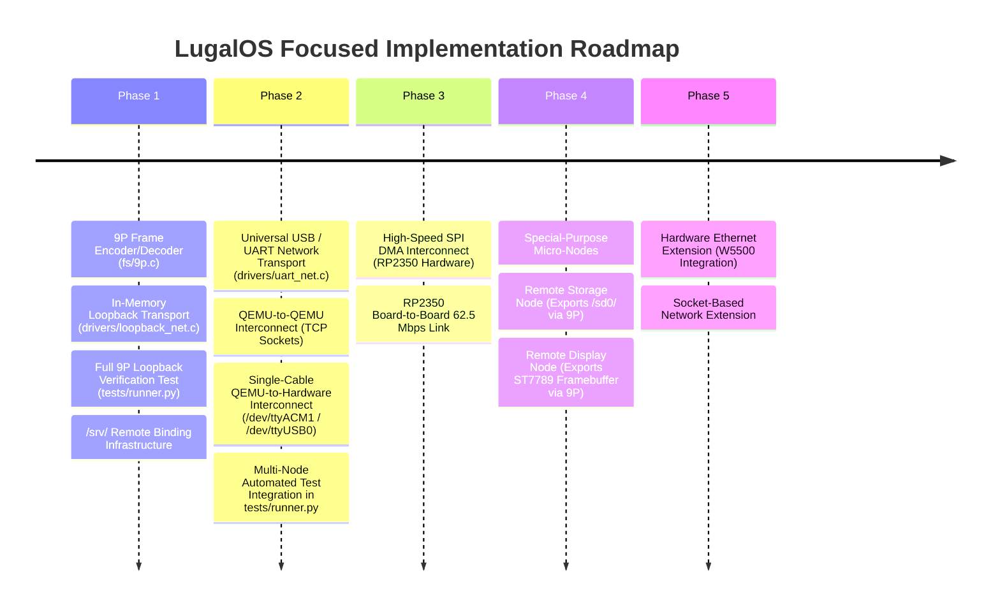

# LugalOS Focused Distributed Architecture & QEMU/Hardware Interconnect Plan

> **Architectural Goal**: A focused, pragmatic implementation roadmap to scale LugalOS from a single microkernel into a distributed network of specialized Plan 9 style micro-nodes (Storage Nodes, Display Nodes, Workstations).
> 
> **Core Strategy**: Prune non-essential protocols (CAN bus, complex Wi-Fi blobs) and leverage **USB / UART as the universal bridge** connecting QEMU simulation instances to physical RP2350 hardware nodes seamlessly over a single cable.

---

## 1. Transparent 9P IPC Abstraction Layer

Plan 9 achieved transparent resource distribution because **everything is a 9P file server**. LugalOS extends its Plan 9 `/srv/` IPC namespace model so that local microkernel IPC calls and remote node RPCs share an identical application contract.



### 9P Micro-Packet Protocol
All LugalOS node communication uses a compact 9P2000 subset:
- **`Tversion` / `Rversion`**: Version negotiation & node auto-discovery.
- **`Tattach` / `Rattach`**: Mount remote namespace (e.g., attach to remote `/srv/display` or `/sd0/`).
- **`Twalk` / `Rwalk`**: Traverse remote directory paths.
- **`Topen` / `Ropen`**: Open remote file/device handles.
- **`Tread` / `Rread`**: Fetch data from remote node.
- **`Twrite` / `Rwrite`**: Send frame or command payloads to remote node.
- **`Tclunk` / `Rclunk`**: Close handle.

---

## 2. Universal Interconnect Strategy: Single-Cable USB & UART Options

To avoid requiring multiple USB cables and CP2102 adapters during development, LugalOS supports 3 serial/interconnect wiring strategies:

```mermaid
flowchart LR
    subgraph CableOpt1 ["Option A: Native RP2350 USB CDC (Single Cable)"]
        PicoUSB["Pico 2 USB Cable"] <-->|/dev/ttyACM0 (Console)| HostPC1["Host PC"]
        PicoUSB <-->|/dev/ttyACM1 (9P Network)| HostPC1
    end

    subgraph CableOpt2 ["Option B: CP2102 Multiplexed UART (Single Cable)"]
        CP2102["CP2102 Adapter"] <-->|/dev/ttyUSB0 (COBS/SLIP Escaped)| HostPC2["Host PC / QEMU"]
    end

    subgraph CableOpt3 ["Option C: Headless Test Mode"]
        CP2102_2["CP2102 Adapter"] <-->|Dedicated 9P Transport| QEMU_Runner["Test Runner"]
    end
```

### Cable Minimization Strategies

#### 1. Option A: Native RP2350 USB CDC ACM Driver (Single USB Cable)
- **Mechanism**: Once LugalOS boots, the RP2350 native USB hardware controller (`0x50110000`) takes control of the onboard USB connector.
- **Composite Ports**: A USB CDC ACM driver presents **two virtual serial ports** over the single micro-USB / USB-C flashing cable:
  - **`/dev/ttyACM0`**: Interactive shell (`lsh`) and UART debug console.
  - **`/dev/ttyACM1`**: High-speed 9P network interconnect to host QEMU / Python test runner!
- **Advantage**: Zero extra wiring, 12 Mbps USB Full-Speed bandwidth, single USB cable for flashing, console, and 9P networking!

#### 2. Option B: CP2102 Multiplexed SLIP/COBS UART (Single Cable)
- **Mechanism**: If using the CP2102 UART adapter (`/dev/ttyUSB0`), binary COBS / SLIP packet framing encapsulates 9P network packets alongside ASCII `printk` log lines.
- **Advantage**: Single serial port carries both human console logs and binary 9P packets.

#### 3. Option C: Headless Interconnect Mode (For Automated Tests)
- **Mechanism**: For automated integration tests, `lsh` shell output is disabled/bypassed, dedicating the serial channel 100% to 9P packet exchange.

---

## 3. Pruned & Focused Hardware Selection

To keep the roadmap tight, focused, and immediately testable:

| Technology | Status | Role in LugalOS Roadmap |
| :--- | :--- | :--- |
| **USB CDC / UART Serial Link** | **Phase 2 (Primary Bridge)** | Universal single-cable link for QEMU-QEMU, QEMU-HW, and board-to-board. |
| **Direct SPI Link** | **Phase 3 (High-Speed HW)** | Board-to-board high-speed DMA interconnect (up to 62.5 Mbps). |
| **WIZnet W5500 Ethernet** | **Phase 5 (Deferred)** | Wired Ethernet backbone (integrated when HW modules arrive). |
| **CAN Bus (MCP2515/PIO)** | **Pruned / Removed** | *Removed from core plan to maintain tight focus.* |
| **CYW43439 Wi-Fi Blobs** | **Pruned / Deferred** | *Deferred to prevent complex vendor firmware dependencies.* |

---

## 4. QEMU-Based Multi-Node Testing Strategy

Testing distributed operating system logic on physical hardware alone is slow and difficult to debug. LugalOS will implement a 3-tier QEMU testing matrix in `tests/runner.py`:



---

## 5. Refined Phased Implementation Roadmap



### Detailed Phase 1 Specification (9P Loopback Engine)

Phase 1 will implement the full original 9P serialization suggestion in pure software without requiring any physical network hardware:

1. **`fs/9p.c` / `fs/include/fs/9p.h`**:
   - Packets: `Tversion`/`Rversion`, `Tattach`/`Rattach`, `Twalk`/`Rwalk`, `Topen`/`Ropen`, `Tread`/`Rread`, `Twrite`/`Rwrite`, `Tclunk`/`Rclunk`.
2. **`drivers/loopback_net.c`**:
   - In-memory ring buffer transport that echoes 9P requests directly to the 9P server engine within the kernel.
3. **VFS `/srv/` Binding**:
   - Mount virtual remote service `/srv/loopback_test`.
4. **Automated Verification**:
   - Complete 9P loopback tests integrated into `tests/runner.py` verifying full round-trip file reads/writes over 9P.

---

## 6. Summary Comparison of Active Interconnect Options

| Interconnect Technology | Target Environment | Throughput | Implementation Complexity | Primary Use Case |
| :--- | :--- | :--- | :--- | :--- |
| **Native RP2350 USB CDC** | RP2350 Hardware & PC | 12 Mbps | Medium (USB Controller) | **Single-Cable Flashing, Console (/dev/ttyACM0) & 9P (/dev/ttyACM1)** |
| **UART Serial Transport** | QEMU & RP2350 Hardware | 115.2 Kbps – 3 Mbps | **Very Low** | **Universal Bridge (QEMU-QEMU, QEMU-HW, HW-HW)** |
| **RP2350 Direct SPI DMA** | RP2350 Hardware | Up to 62.5 Mbps | Low | **High-Speed Board-to-Board Node Link** |
| **WIZnet W5500 SPI Ethernet** | RP2350 Hardware (Phase 5) | 15–20 Mbps | Medium | **Wired Ethernet Infrastructure Network** |
